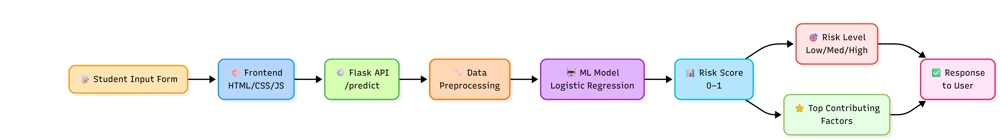

# Student Dropout Risk Prediction

## Problem
Predict whether a student is at risk of dropping out using academic and demographic features.

## Motivation — Why This Problem Matters

Student dropout is a major challenge for educational institutions, leading to financial loss and reduced academic outcomes. Early identification of a student at risk of dropping out enables timely interventions, improving retention and student success.

---

## Features
- Predicts dropout risk (probability)
- Classifies risk into Low / Medium / High
- Highlights top contributing factors
- REST API using Flask

---

## Tech Stack
- Python
- Flask
- Scikit-learn (Logistic Regression)
- Pandas

---

## Architecture



---

## Model Details
- Features are scaled using StandardScaler
- Model outputs probability using predict_proba
- Feature impact computed using model coefficients
- Logistic Regression used for classification

---

## Model Performance

The model was evaluated using a stratified train-test split to handle class imbalance effectively.

* **Accuracy:** ~0.86
* **F1 Score (Dropout class):** ~0.79
* **Recall (Dropout class):** ~0.82
* **Precision (Dropout class):** ~0.75

The model prioritizes **recall** to ensure that most at-risk students are correctly identified, even at the cost of some false positives.

---

## Approach

To make predictions interpretable, the system computes **feature contributions for each individual prediction** using:

> **Contribution = Coefficient × Standardized Feature Value**

This allows the model to identify the **top factors influencing risk** for a specific student.

* Features with **positive contribution** increase dropout risk
* Features with **negative contribution** reduce dropout risk

The system then surfaces the **top contributing features** along with directional explanations (increase/decrease risk), making predictions actionable and transparent.

---

## How to Run

```bash
pip install -r requirements.txt
python app.py
```

---

## API Endpoint

`POST /predict`

---

## Example Output

```json
{
  "risk_score": 0.62,
  "risk_level": "Medium",
  "factors": [
    "Grade – 1st sem (decreases risk)",
    "Assessments Attempted – 2nd sem (increases risk)"
  ]
}
```
